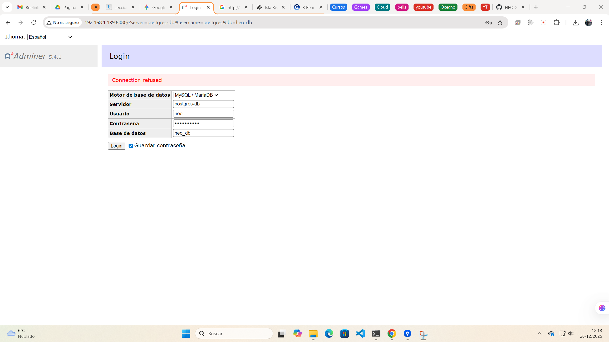

\# 🐘 PostgreSQL + Adminer Stack


Entorno de base de datos relacional dockerizado para laboratorio local.


\## 📦 Servicios Incluidos

1\. \*\*PostgreSQL 15:\*\* Motor de base de datos robusto.

&nbsp;  - Datos persistentes en volumen `postgres\_data`.

2\. \*\*Adminer:\*\* Interfaz web ligera para gestionar la DB.

&nbsp;  - Accesible en: `http://IP-DEL-SERVIDOR:8080`


\## 🛠️ Despliegue

Para levantar el stack, usar Docker Compose (o Portainer Stacks):


```bash

docker-compose up -d

---
## 📸 Galería de Despliegue (Pruebas de Vida)

### 1. Verificación de contenedores en el servidor
Comprobación vía terminal SSH de que los servicios están activos.
(./img/02-servidores-status.png)

### 2. Conexión interna a PostgreSQL
Acceso mediante CLI (`psql`) dentro del contenedor para verificar la base de datos `heo_db`.


### 3. Acceso Web vía Adminer
Interfaz gráfica en el puerto 8080 lista para conectar con el motor de base de datos.
(./img/04.2-adminer-login-enter.png)
